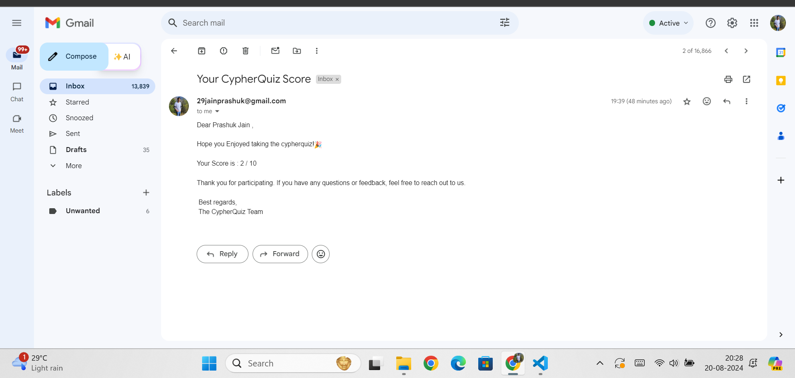
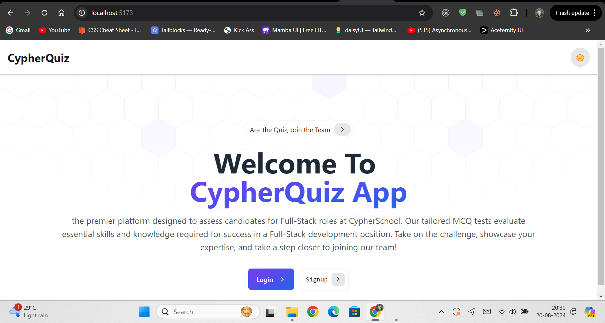
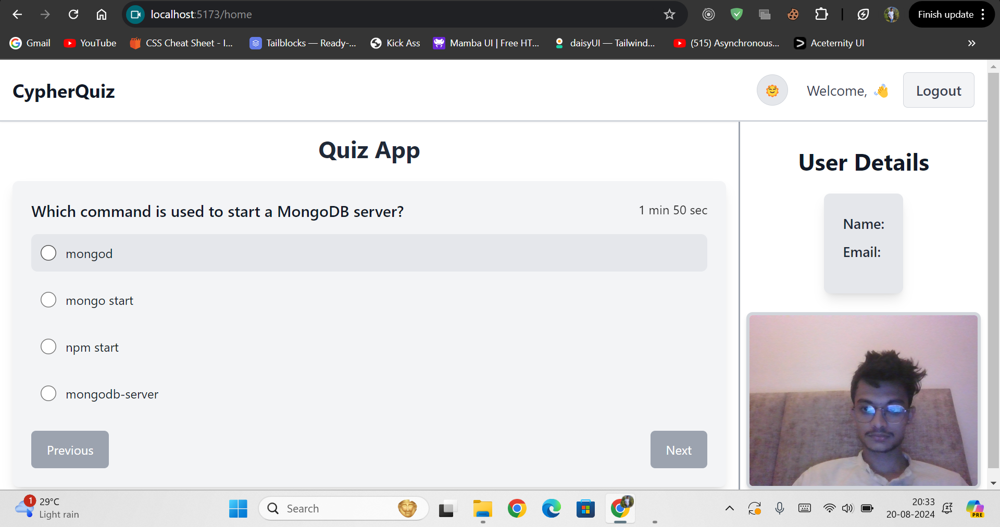
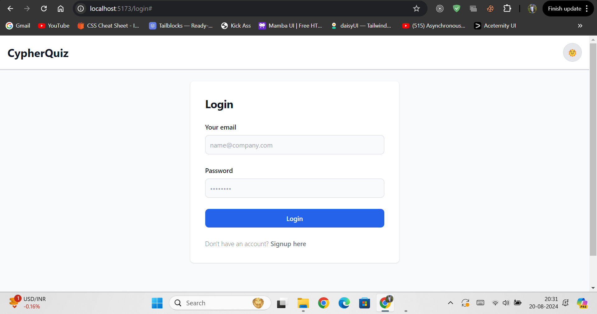
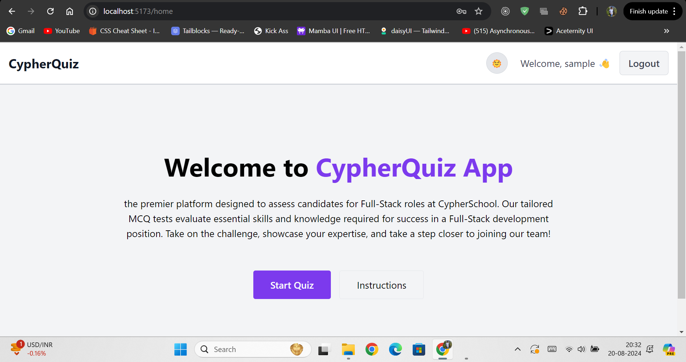
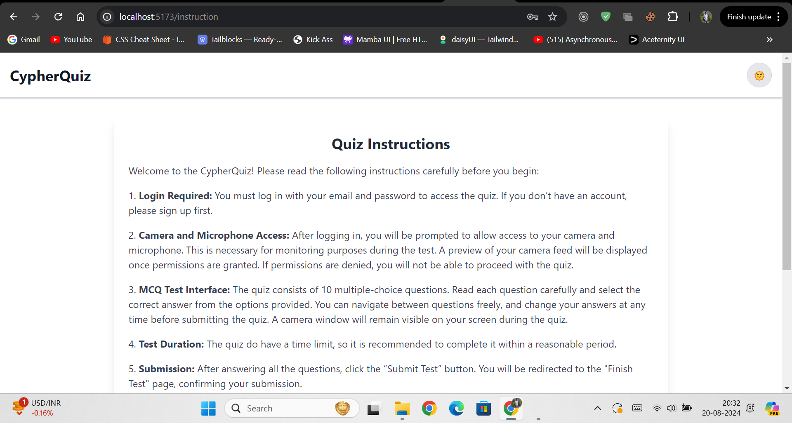

# Test Environment Platform

This repository contains the code for the Full-Stack Developer Assignment, a web-based platform that allows students to take multiple-choice questions (MCQ) tests. The platform manages user authentication, test administration, and evaluation, and displays results to users.

## Introduction

This platform was developed as part of a Full-Stack Developer assignment. It provides a test environment where students can log in, take an MCQ test, and receive their scores via email. The platform is built using React for the frontend and Node.js with Express for the backend, with MongoDB as the database.

## Features

- **User Authentication**: Secure login system using email and password.
- **Test Environment**: 
  - Request permissions for camera and microphone access.
  - Error handling for missing permissions.
- **MCQ Test Interface**:
  - Navigate between questions.
  - Select and change answers.
  - Display camera feed during the test.
- **Test Submission**: Submit the test and receive a score via email.
- **Automated Evaluation**: A cron job runs every hour to evaluate submitted tests and send results. (Running Only In localserver As Vercel Doesn't support cron-jobs)

## Tech Stack

- **Frontend**: React.js, Tailwind CSS
- **Backend**: Node.js, Express.js
- **Database**: MongoDB
- **Authentication**: JSON Web Tokens (JWT)
- **Cron Job**: node-cron
- **Email Service**: Nodemailer

## Installation

1. Clone the Frontend repository:

   ```bash
   git clone https://github.com/Jainprashuk/CypherQuiz_Frontend.git
   cd CypherQuiz_Frontend
   
2. Clone the Backend repository:

   ```bash
   git clone https://github.com/Jainprashuk/CypherQuiz_Backend.git
   cd CypherQuiz_Backend

3. Install dependencies for  frontend :

   ``` bash
   cd CypherQuiz_Frontend
   npm install

4. Install dependencies for  Backend :
   ``` bash
   cd CypherQuiz_Backend
   npm install

5. Create a .env file in the root directory of the server and add the following variables:
   ```bash
   PORT=3000
   MONGOURL=mongodb+srv://<user>:<pass>@cluster0.xjwn7dv.mongodb.net/

6. Start the Backend development server:
   ```bash
   cd CypherQuiz_Backend
   npm start
   
7. Start the Frontend development server:
   ```bash
   cd CypherQuiz_Frontend
   npm run dev

## Cron-Job Mail

1. Format
   ```bash
   Subject: Your CypherQuiz Score

   Dear {UserName} ,

   Hope you Enjoyed taking the cypherquiz!🎉

   Your Score is : 7 / 10

   Thank you for participating. If you have any questions or feedback, feel free to reach out to us.

   Best regards,
   The CypherQuiz Team

2. Mail Image sample
   

## Test User Credentials
   
   1. Email : sample@gmail.com
   2. Password : 1234

## Sreenshots Of working Application





